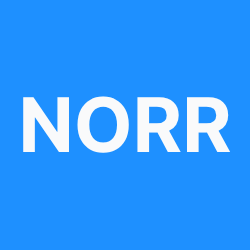

  
  Norr

**Norr** is a modular and modern .NET library ecosystem focused on performance, observability, clean architecture, and developer productivity.  
All libraries are lightweight, production-ready, and designed with scalability in mind.

## 📦 Available Packages

| Package | Description |
|--------|-------------|
| [`Norr.PerformanceMonitor`](https://www.nuget.org/packages/Norr.PerformanceMonitor) | Advanced performance monitoring with OpenTelemetry integration, threshold-based alerting, and execution profiling support. |
| [`Norr.PerformanceMonitor.Attribution`](https://www.nuget.org/packages/Norr.PerformanceMonitor.Attribution) | Source generator that enables `[MeasurePerformance]` attribute-based instrumentation. Used by `Norr.PerformanceMonitor`. |

## 🧭 Roadmap

Coming soon:

- `Norr.Logging`
- `Norr.Validation`
- `Norr.Messaging`
- `Norr.Configuration`
- `Norr.Diagnostics`

## 🚀 Usage

Each package is standalone and follows Clean Architecture principles.  
Refer to individual package READMEs for installation and examples.

## 📄 License

[MIT](./LICENSE) © 2025 Berkay Huz  
